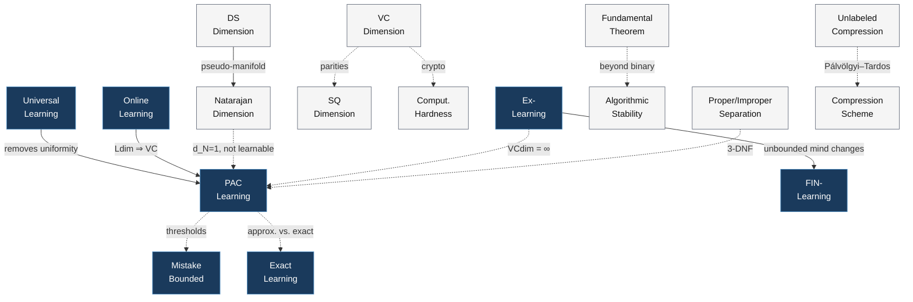
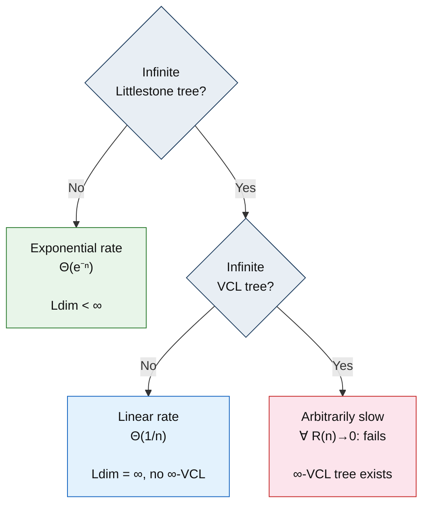
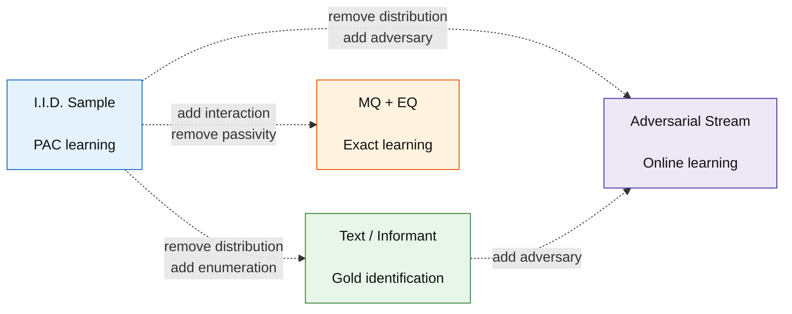
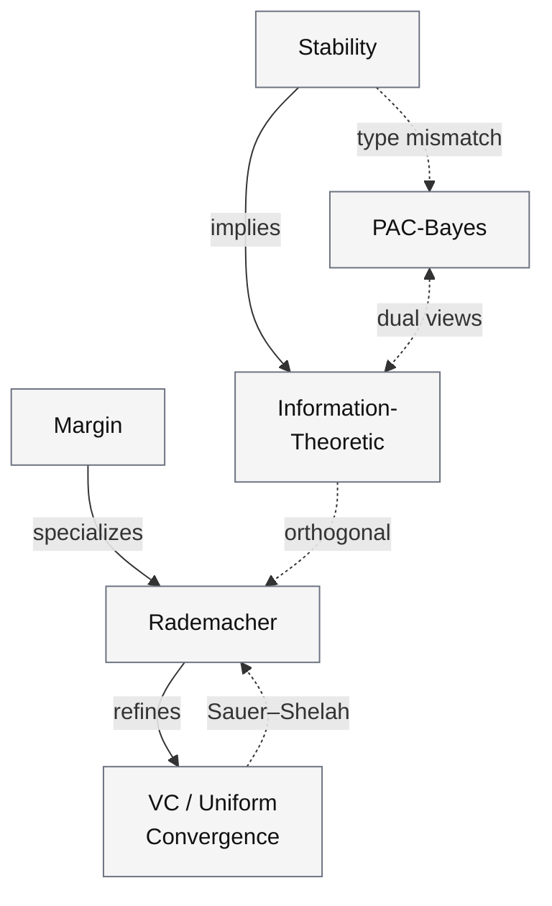

# A Textbook of Formal Learning Theory

**Six Paradigms, Their Characterization Theorems, and the Separations Between Them**

Every characterization theorem in learning theory answers one question: *when does finite combinatorial structure guarantee learning from data?* VC dimension characterizes PAC learning. Littlestone dimension characterizes online learning. Mind-change ordinals characterize Gold-style identification. These results span six decades, three research traditions, and five distinct proof technologies. No single textbook has treated them all.

But a field is not defined only by what holds. It is defined equally by what *does not* hold — and the witnesses that prove it.

**Author:** Dhruv Gupta, Zetesis Labs, dhruv@zetesislabs.com
---

## The Negative Layer

Consider the class of thresholds on the real line: C = {x &#8614; **1**[x &le; t] | t &isin; R}. Its VC dimension is 1 — only singletons are shattered, because thresholds are monotone. Every PAC textbook would call this class trivially learnable.

Now let an adversary play online. It binary-searches the threshold by querying midpoints, forcing one mistake per query. The Littlestone dimension is infinite. The class is not online-learnable with bounded mistakes.

PAC learnability does not imply online learnability. The witness is three lines. The proof in the [companion Lean4 kernel](https://github.com/Zetetic-Dhruv/formal-learning-theory-kernel) is 40 lines of machine-checked Lean4.

This book has nine such separations, each with an explicit witness construction. It has analogy-obstruction pairs where the analogy between paradigms is precise — and the *obstruction* that blocks a formal upgrade is analyzed (type mismatch? data model mismatch? proof method mismatch?). It has boundaries where one framework's characterization theorem provably fails to generalize.

Most textbooks treat separations as exercises or asides. This book gives them equal weight. The separations are what make the field's architecture legible.

### The separation lattice

The full negative layer: 9 non-implications (dashed) and 4 strict inclusions (solid), each labeled with its witness.



*Solid arrows: strictly stronger (the implication holds but is non-reversible). Dashed arrows: does not imply (the witness named on the edge proves the failure).*

---

## What Formalization Revealed

This textbook was written alongside a [14,945-line Lean4 formalization](https://github.com/Zetetic-Dhruv/formal-learning-theory-kernel) — 204 theorems, 0 sorry on the critical path. Forcing learning theory through a type checker exposed five structural features that textbooks suppress. The textbook presents the corrected versions. A reader of this book gets definitions that have survived machine verification.

1. **The No-Free-Lunch theorem is false for finite domains.** For finite X, VCdim(Set.univ) = |X| < infinity. The memorizer learns everything. The correct NFL requires infinite X.

2. **The standard Littlestone tree definition has a bug.** The branch-wise definition does not restrict the concept class at recursive calls. Under it, {const\_true, const\_false} has Littlestone dimension infinity. The characterization theorem is false.

3. **Quantifier ordering in uniform convergence is load-bearing.** "For all epsilon, exists m\_0, for all D" is not the same as "for all epsilon, for all D, exists m\_0." The first makes sample complexity distribution-free. The second makes PACLearnable trivially true via memorization.

4. **Measure-theoretic regularity is non-negotiable.** For uncountable concept classes, the "bad event" {sup |true\_err - emp\_err| &ge; epsilon} is not MeasurableSet. NullMeasurableSet suffices, but the condition must be stated. Pen-and-paper proofs suppress it.

5. **No common learner type exists.** A BatchLearner takes a sample and returns a hypothesis. An OnlineLearner commits to a prediction before seeing the label. A GoldLearner conjectures from a growing prefix of an enumeration. No parent type captures all three without destroying the property each characterization theorem quantifies over. The type system does not permit conflation. This is not a limitation. It is the mathematics.

---

## The Programme

This textbook is one of five public repositories. They are not independent releases.

| Repository | What it is | Scale |
|-----------|-----------|-------|
| **[formal-learning-theory-book](https://github.com/Zetetic-Dhruv/formal-learning-theory-book)** | Informal exposition (this repo) | 202 pages, 18 chapters |
| **[formal-learning-theory-kernel](https://github.com/Zetetic-Dhruv/formal-learning-theory-kernel)** | Machine-checked proofs in Lean4 | 14,945 LOC, 204 theorems, 2 sorry (frontier) |
| **[formal-learning-theory-dataset](https://github.com/Zetetic-Dhruv/formal-learning-theory-dataset)** | Structured concept graph | 142 nodes, 260 edges, 13 relation types |
| **[formal-learning-theory-discovery](https://github.com/Zetetic-Dhruv/formal-learning-theory-discovery)** | Discovery process documentation | 74 reasoning traces, 19 proof methods, 7 break points |
| **[First-Proof-Benchmark-Results](https://github.com/Zetetic-Dhruv/First-Proof-Benchmark-Results)** | AI proof discovery benchmarks | Empirical analysis across frontier models |

The textbook's logical structure is encoded in the [concept graph](https://github.com/Zetetic-Dhruv/formal-learning-theory-dataset). The concept graph informed the type architecture that structures the [kernel](https://github.com/Zetetic-Dhruv/formal-learning-theory-kernel). The kernel's proof discoveries — and its 7 dead-end branches, each a discovery of what *cannot* work — are documented in the [discovery repository](https://github.com/Zetetic-Dhruv/formal-learning-theory-discovery).

The textbook treats as mathematics what the kernel verifies as Lean4.

### Kernel status

The kernel contains sorry-free proofs of:

- **The VC characterization** — PAC learnability iff finite VC dimension
- **The fundamental theorem** — 5-way equivalence (4/5 conjuncts; the 5th requires Moran-Yehudayoff 2016)
- **The Littlestone characterization** — online learnability iff finite Littlestone dimension
- **Gold's theorem** — identification in the limit + mind-change characterization
- **The universal trichotomy** — 2/3 branches (the 3rd requires BHMZ STOC 2021)
- **All paradigm separations** — 9 non-implications with constructive witnesses
- **The symmetrization chain** — 3,027 LOC, the irreducible bridge from combinatorics to measure theory

Two sorrys remain. Both are blocked by deep combinatorial constructions absent from Mathlib — Moran-Yehudayoff's compression theorem and BHMZ's one-inclusion graph learners. These are the frontier, not engineering gaps.

### The trichotomy: an online concept in a statistical theorem

The PAC tradition expected VC dimension to determine learning *rates*. It does not. Two classes with the same VC dimension can have different optimal rates. What draws the boundary?

The Littlestone dimension — an adversarial, combinatorial object built for worst-case online games. No connection to statistical convergence rates. None expected. And yet:



*The trichotomy theorem (Bousquet et al., 2021). Two binary questions partition all learnable classes into exactly three rate regimes. There is no fourth regime and no intermediate rate. The first question is about the Littlestone dimension — an online learning concept controlling a statistical convergence rate.*

---

## Structure

Five parts. 18 chapters. 4 appendices.

Each paradigm is generated by a different data model. No paradigm subsumes the others.



**Part I: Foundations** (Ch. 1--3) — Domains, concepts, hypothesis spaces, data presentations, automata-theoretic vocabulary for identification in the limit.

**Part II: Paradigms** (Ch. 4--9) — Each with its characterization theorem proved in full:

| Ch. | Paradigm | Characterization |
|-----|----------|-----------------|
| 5 | PAC learning | VC dimension |
| 6 | Online learning | Littlestone dimension |
| 7 | Gold-style identification | Mind-change ordinals |
| 8 | Exact learning | Query models |
| 9 | Universal learning | Trichotomy theorem |

**Part III: Complexity Measures** (Ch. 10--13) — 33 measures. Five generalization frameworks, each projecting the data-class-algorithm interaction onto a different axis:



*Solid: implication. Dashed: obstruction or mediation. The obstructions are as informative as the implications — stability and PAC-Bayes measure different types of objects (algorithms vs. distributions).*

**Part IV: The Negative Layer** (Ch. 14--15) — All separation results with witness constructions. All analogy-obstruction pairs with obstruction analysis.

**Part V: Extensions** (Ch. 16--18) — Computational hardness, multiclass and real-valued extensions (Natarajan dimension, DS dimension, pseudodimension, fat-shattering), open frontiers.

---

## Preview

### Theorem and concept index

The major theorems proved in full, organized by paradigm.

**Characterization theorems** — the load-bearing results:

| Theorem | Chapter | Statement |
|---------|---------|-----------|
| VC Characterization | 5 | C is PAC-learnable iff VCdim(C) < infinity |
| Fundamental Theorem | 5 | Nine equivalent conditions for PAC learnability (5-way equivalence in the [kernel](https://github.com/Zetetic-Dhruv/formal-learning-theory-kernel)) |
| Littlestone Characterization | 6 | C is online-learnable iff Ldim(C) < infinity |
| Gold's Theorem | 7 | Impossibility of identification from text for classes mixing finite and infinite languages |
| L* Correctness | 8 | Angluin's algorithm learns DFAs in polynomial time with MQ + EQ |
| Trichotomy Theorem | 9 | Learning rates partition into exponential / linear / arbitrarily slow |
| DS Characterization | 17 | DS dimension characterizes multiclass PAC learnability |

**Separation theorems** — the negative layer:

| Separation | Witness | Chapter |
|-----------|---------|---------|
| PAC does not imply online | Thresholds on R: VCdim = 1, Ldim = infinity | 14 |
| Ex-learning does not imply PAC | All finite subsets of N: identifiable, VCdim = infinity | 14 |
| Finite VCdim does not imply efficient PAC | Poly-size circuits under cryptographic assumptions | 14, 16 |
| Low VCdim does not imply low SQdim | Parities: VCdim = n, SQdim = 2^n | 14 |
| Proper does not imply efficient proper | 3-term DNF: NP-hard proper, poly-time improper | 14, 16 |
| Labeled compression does not imply unlabeled | Palvolgyi-Tardos 2020: VC-2 class, no unlabeled scheme | 11, 14 |
| Fundamental theorem breaks beyond binary | Shalev-Shwartz et al. 2010: UC does not imply learnability | 14 |
| Natarajan dimension does not characterize multiclass | d_N = 1 but not learnable when \|Y\| = infinity | 10, 17 |
| FIN strictly contained in Ex | Unbounded mind changes required for some classes | 7, 13 |

**Complexity measures** — 33 measures across four categories:

| Category | Measures | Chapters |
|----------|---------|----------|
| Combinatorial dimensions | VCdim, Ldim, DSdim, Natarajan dim, pseudodimension, fat-shattering dim, star number, dual VCdim, graph dimension | 10 |
| Compression & sample complexity | Compression size, sample complexity, teaching dimension, covering number, packing number, growth function | 11 |
| Generalization bounds | VC bound, Rademacher complexity, PAC-Bayes, algorithmic stability, mutual information bound, margin bound | 12 |
| Mind-change ordinals | Finite mind changes, ordinal mind changes, anomaly hierarchy, BC learning | 13 |

**Infrastructure theorems** — the proof machinery:

| Theorem | Role | Scale |
|---------|------|-------|
| Sauer-Shelah Lemma | Growth function bounded by poly(VCdim) | Ch. 10, [kernel](https://github.com/Zetetic-Dhruv/formal-learning-theory-kernel): Bridge.lean |
| Symmetrization (ghost sample) | Exchanges sup and expectation for uncountable classes | Ch. 5, [kernel](https://github.com/Zetetic-Dhruv/formal-learning-theory-kernel): 3,027 LOC |
| Rademacher-VCdim connection | VCdim bounds Rademacher complexity | Ch. 12, [kernel](https://github.com/Zetetic-Dhruv/formal-learning-theory-kernel): 1,901 LOC |
| Hoeffding one-sided | Concentration inequality for bounded random variables | Ch. 5, 12 |
| Occam's Razor | Short descriptions generalize (Blumer-Ehrenfeucht-Haussler-Warmuth) | Ch. 11 |
| Moran-Yehudayoff Compression | Finite VCdim implies exponential compression scheme | Ch. 11 (open: O(d) conjecture since 1986) |

### From the textbook

Excerpts that show what this book does differently.

---

**On why separations are first-class content** (Ch. 14):

> A separation result has two components. The *statement* asserts that some implication A implies B does not hold. The *witness* is a concrete mathematical object — a concept class, a dimension pair, a computational reduction — that demonstrates the failure. The witness is the mathematics; the statement is merely its summary. Throughout this chapter, we privilege the construction over the claim.

---

**On the trichotomy — the revelation** (Ch. 9):

> The online learning tradition introduced the Littlestone dimension to characterize mistake-bounded learning against an adversary. A worst-case combinatorial quantity, built for a worst-case adversarial game. No connection to statistical convergence rates. None expected.
>
> And yet. The Littlestone dimension — this adversarial, combinatorial object — is exactly what governs the boundary between exponential and polynomial convergence in the i.i.d. setting.

---

**On data models as the axis of fracture** (Ch. 2):

> Four fundamentally different data models — i.i.d. samples, enumerative texts, query oracles, and adversarial streams — give rise to four different theories of learnability, characterized by four different complexity measures, and separated by explicit impossibility results. The data model is not a parameter of a single theory; it is the axis along which the field fractures into distinct paradigms.

---

**On convergence without convergence signals** (Ch. 7):

> This simple algorithm illustrates a crucial asymmetry: the learner does not know when it has converged. It has no way to announce "I am done." It merely stabilizes, silently. This lack of a convergence signal is what makes Gold's impossibility theorem possible.

---

**On the compression conjecture** (Ch. 11):

> The natural conjecture — that compression of size O(d) always suffices — has been open since 1986. It is one of the oldest and most embarrassing open problems in learning theory, and it is the centerpiece of this chapter. Everything we prove either approaches this question or illuminates why it resists resolution.

---

**On obstruction types as mathematical content** (Ch. 15):

> The key insight of this chapter is that the obstruction type is more informative than the analogy itself. Two analogies may look superficially similar ("X is like Y because both measure complexity") but fail for entirely different reasons: one because the objects live in different type systems, another because a conjectured equivalence remains unproved. The obstruction type tells you *why* the analogy fails, and this "why" determines whether the analogy might become a theorem in the future, or is structurally blocked.

---

**On the epsilon vs. epsilon-squared gap** (Ch. 5):

> The gap emerges only when H is infinite and VC dimension replaces log|H|. Realizability is not just a simplifying assumption — it provides a qualitatively different information structure.

---

**On the sparsity of the separation lattice** (Ch. 14):

> The lattice is sparse. Thirteen edges connect concepts drawn from six paradigms and a dozen complexity measures. Most paradigm pairs are simply incomparable — they neither imply nor contradict each other, because they operate on different mathematical objects. The sparsity is itself informative: learning theory is not a linear hierarchy from weak to strong, but a partially ordered collection of largely independent formalisms.

---

## The Concept Graph

The book's logical skeleton, encoded as a typed directed graph.

```
142 nodes  ·  260 edges  ·  13 relation types  ·  133 kernel nodes
```

**Relations:** `defined_using` · `instance_of` · `characterizes` · `upper_bounds` · `lower_bounds` · `requires_assumption` · `strictly_stronger` · `measures` · `analogy` · `does_not_imply` · `used_in_proof` · `restricts` · `extends_grammar`

Every relation has a formal inverse. Every `does_not_imply` edge carries a witness. Every `analogy` edge with an obstruction carries an `obstruction_type`. The graph is the same artifact that informed the kernel's type architecture — the textbook and the Lean4 formalization share a common logical skeleton.

Located in [`supplementary/flt_concept_graph.json`](supplementary/flt_concept_graph.json), with:

- **[`flt_tasks.json`](supplementary/flt_tasks.json)** — 15 benchmark queries (prerequisite retrieval, characterization queries, non-implication checks)
- **[`flt_task_answers.json`](supplementary/flt_task_answers.json)** — Reference answers with expected paths
- **[`flt_commentary.json`](supplementary/flt_commentary.json)** — Extended commentary on select nodes

---

## Building the PDF

```bash
cd textbook
pdflatex main.tex && bibtex main && pdflatex main.tex && pdflatex main.tex
```

Pre-built: [`textbook/Textbook.pdf`](textbook/Textbook.pdf). Requires `pdflatex`, `bibtex`, and standard packages (`amsmath`, `tikz`, `tcolorbox`, `hyperref`, `cleveref`).

## Prerequisites

Basic probability (concentration inequalities), combinatorics (growth functions), computability theory (decidability, halting problem — for Gold-style chapters), and mathematical maturity for epsilon-delta arguments. No machine learning background required.

## Repository Layout

```
textbook/
  main.tex                  Master document
  chapters/                 ch01–ch18
  appendices/               Edge inventory, traversals, validation, notation
  Textbook.pdf              Pre-built (202 pages)
  LICENSE                   CC BY-NC-SA 4.0

supplementary/
  flt_concept_graph.json    142 nodes, 260 edges
  flt_tasks.json            15 benchmark queries
  flt_task_answers.json     Reference answers
  flt_commentary.json       Extended commentary
```

## License

[CC BY-NC-SA 4.0](https://creativecommons.org/licenses/by-nc-sa/4.0/).

## Citation

```bibtex
@book{gupta2026flt,
  author    = {Dhruv Gupta},
  title     = {A Textbook of Formal Learning Theory: Six Paradigms, Their
               Characterization Theorems, and the Separations Between Them},
  year      = {2026},
  publisher = {Zetesis Labs},
  address   = {Bangalore},
  note      = {202 pages, 18 chapters. Companion Lean4 formalization
               at \url{https://github.com/Zetetic-Dhruv/formal-learning-theory-kernel}.}
}

@software{gupta2026flt_kernel,
  author    = {Gupta, Dhruv},
  title     = {Formal Learning Theory Kernel: {Lean4} Formalization
               of the Fundamental Theorem of Statistical Learning},
  year      = {2026},
  url       = {https://github.com/Zetetic-Dhruv/formal-learning-theory-kernel},
  note      = {14{,}945 LOC, 204 theorems, 2 sorry.}
}

@software{gupta2026flt_discovery,
  author    = {Gupta, Dhruv},
  title     = {Formal Learning Theory Discovery: Empirical Analysis
               of {AI}-Guided Proof Search},
  year      = {2026},
  url       = {https://github.com/Zetetic-Dhruv/formal-learning-theory-discovery},
  note      = {74 reasoning traces, 19 proof methods, 7 break points.}
}
```

## Attribution

Copyright (c) 2026 Dhruv Gupta, Zetesis Labs.

The textbook and concept graph were developed alongside a Lean4 formalization built using Claude Opus 4.6 (Anthropic) via Claude Code, guided by an epistemological framework for structured AI-assisted formalization. The mathematical content, editorial structure, and all design decisions are the author's.
